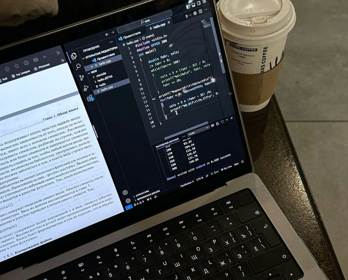

# Actividad de Investigacion 🚀
1. ¿Qué es un computador? Escribe una definición oficial y la referencia bibliográfica. 

R/ Es una máquina que procesa y ejecuta órdenes de diversa índole para dar como resultado un sinfín de tareas distintas, para funcionar necesita tener un hardware y software. El hardware son los elementos físicos como el teclado, el mouse, pantalla, cables, plaquetas, etc. El software son los programas, sistemas operativos y funciones instaladas que le dan vida y coordinan lo material para funcionar.

Fuente: https://concepto.de/computador/#ixzz8zIS8Oq8N

2. Arquitecturas de un computador: dar una breve definición de qué es una arquitectura de computador. Describir cómo están construidas y en qué equipos modernos se pueden encontrar.

 R/ Definición: la Arquitectura de un computador determina el rendimiento, la eficiencia y la capacidad de una computadora para ejecutar tareas y manejar grandes cantidades de datos. Además, permite que los desarrolladores y los ingenieros creen dispositivos y sistemas informáticos cada vez más poderosos, eficientes y seguros.

### Se conforma principalmente por:  
 CPU (Unidad Central de Procesamiento): El cerebro del ordenador que ejecuta las instrucciones del programa. 

Memoria: almacena datos y programas que están en uso o están a punto de ser utilizados por la CPU.

Dispositivos de entrada/salida: Permiten la interacción del ordenador con el mundo exterior. 

Buses: Proporcionan canales de comunicación entre la CPU, la memoria y los dispositivos de E/S. 

Unidad de control: Coordina las operaciones entre la CPU, la memoria y los dispositivos de E/S. 

Fuente:https://www.educaopen.com/digital-lab/metaterminos/a/arquitectura-de-ordenadores

| Arquitectura CISC |Arquitectura RISC|
|--------------|--------------|
| Se especializa en crear instrucciones complejas en el hardware, ya que el hardware siempre será mucho más rápido que el software, este tipo de diseño es la base de los procesadores de Intel y de AMD, sin importar la gama o la estructura interna. Sus caracteristicas son; el tamaño de su codigo es pequeño, suelen necesitar más de un ciclo de reloj para ejecutar el código, menos instrucciones para escribir un software, programación más sencilla,estructura de datos compleja y fácil de compilar, menos registros y más nodos de direccionamiento, enfatiza la construcción de instrucciones en el hardware.|basada en una colección de instrucciones simples y altamente personalizadas,  RISC se construye para minimizar el tiempo de ejecución de una instrucción, optimizando y limitando el número de instrucciones,  tiene la capacidad de por cada ciclo de instrucción se da solo un ciclo de reloj. Caracteristicas; para ejecutar una isntruccion requiere de un ciclo reloj, contiene tecnica de canalizacion lo cual ayuda a que su funcionamiento sea mas eficiente, modo de direccionamiento simple, Usan instrucciones LOAD y STORE para acceder a la memoria, usan instrucciones simples y limitadas permiten reducir los tiempos de ejecución de un proceso.

Fuente:https://www.profesionalreview.com/2021/07/18/risc-vs-cisc/

3. ¿Qué es el hardware? Incluye los más relevantes, te voy a dar algunos elementos, pero si encuentras más, los puedes incluir.
a. CPU. Escribe una definición y sus partes más relevantes. 
      
- ALU. Definición y función.
 - Unidad de control. Definición y función.
- Registros. Definición y función.
- Buses. Definición y función.

b. Memoria

- Registros.
 - Caché.
 - Principal (RAM).
 - Secundaria (Disco duro y unidades externas de almacenamiento).

c. Dispositivos de entrada / salida.

d. Buses de datos.

4. ¿Qué es el software?

a. Software de sistema.

b. Software de aplicación.

c. Software de desarrollo.

5. Funcionamiento del computador:

a. ¿Qué procesos se llevan a cabo cuando se enciende una computadora?

b. ¿Qué sucede desde que ingreso un dato a través del teclado, hasta que veo el resultado de la operación en la pantalla?

c. ¿Cómo se codifican los datos internamente en el computador?

d. ¿Cuáles son las unidades de medida de datos en un computador? Bit, Byte, etc.

