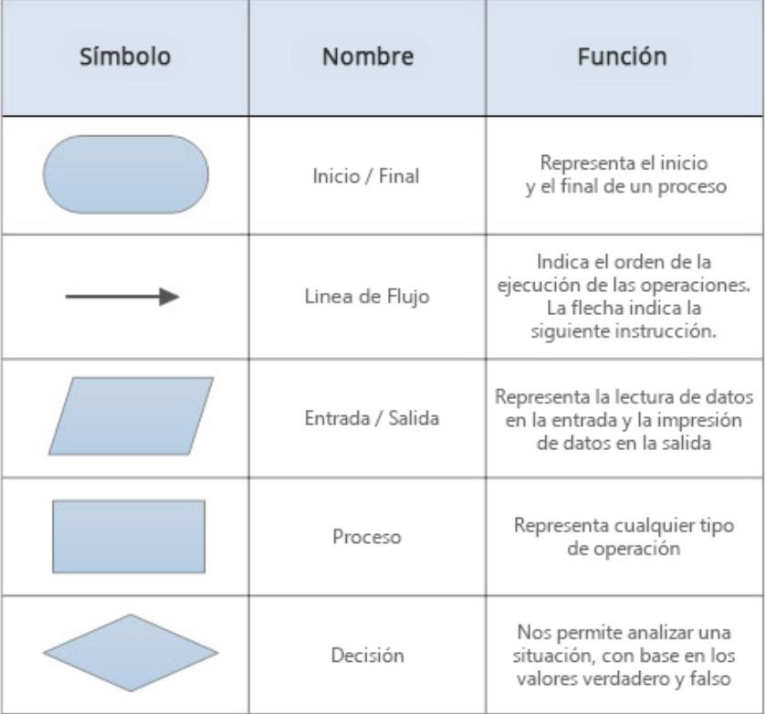

# Algotirmos 📊

## Reglas para el uso de diagramas de flujo 📖

¿Cuáles son los símbolos que se utilizan para representar cada operación de un algorimo con un diagrama de flujo?

## Ejercicios 🧠
### Parte 1: Identificación de algoritmos

a) Una página web.

No es un algoritmo, ya que se trata de una estructura informativa y representativa, pero no sigue un conjunto de pasos secuenciales con un objetivo claro.

b) Una receta para hacer un pastel, con ingredientes y pasos a seguir.

Es un algoritmo, ya que proporciona una secuencia de pasos bien definidos con el fin de obtener un resultado final.

c) "Piensa en un número y multiplícalo por otro."

No es un algoritmo, aunque sugiere una operación matemática, no explica con claridad los pasos para llegar al resultado.

d) Un manual de instrucciones para armar un mueble, con pasos detallados y un orden claro.

s un algoritmo, ya que presenta una secuencia ordenada de pasos para alcanzar un objetivo específico.

e) Una lista de compras organizada en orden alfabético.

No es un algoritmo, ya que es solo una colección de datos ordenados y no define un proceso o conjunto de pasos para lograr un objetivo.

### Parte 2: Variables y Constantes

a) El valor de la gravedad en la Tierra, 9.8 m/s².

Es una constante, porque la aceleración de la gravedad en la Tierra tiene un valor fijo bajo condiciones normales.

b) La edad de una persona calculada en base al año actual y su año de nacimiento.

Es una variable, porque la edad de una persona cambia con el tiempo.

c) La cantidad de dinero en una cuenta bancaria.

Es una variable, ya que el saldo de una cuenta bancaria cambia con los depósitos y retiros.

d) La velocidad de la luz en el vacío, 299,792,458 m/s.

Es una constante, ya que la velocidad de la luz en el vacío tiene un valor fijo y no cambia.

e) El radio de un círculo.

Es una variable, pues el radio de un círculo puede variar dependiendo del círculo en cuestión.

### Parte 3: Características de los algoritmos

a) Para elegir la ruta más corta entre varias ciudades, el algoritmo examina rutas candidatas, deteniéndose cuando los cambios en la distancia parecen lo suficientemente pequeños.

No cumple con las características de un algoritmo, ya que la condición es imprecisa, lo que impide cumplir con la precisión que se espera en un algoritmo.
Un algoritmo debe ser claro y tener un criterio de finalización bien definido.

b) Suma los números ingresados y muestra el resultado.

Sí cumple con las características de un algoritmo, ya que tiene un procedimiento claro (sumar números), entrada (los números), salida (la suma) y es finito (termina cuando se obtiene el resultado).

c) Un conjunto de pasos para calcular el área de un rectángulo dado su base y altura.

Sí cumple con las características de un algoritmo, ya que tiene entrada (base y altura), un proceso definido (multiplicar base por altura), salida (el área) y es finito.

d) El algoritmo cuenta el número de votos obtenidos por cada candidato en una elección para presidente. Empieza solicitando el nombre del candidato y termina cuando se ingresa el valor -1.

Sí cumple con las características de un algoritmo, pues tiene entrada (los votos y nombres de los candidatos), un proceso definido (contar votos), salida (cantidad de votos por candidato) y es finito (termina cuando se ingresa -1).

### Parte 4: Comprensión de Herramientas
a) El pseudocódigo utiliza símbolos estándar para representar las operaciones lógicas.

FALSO, el pseudocódigo es una descripción estructurada de un algoritmo usando palabras clave y sintaxis parecida a la de los lenguajes de programación, pero no utiliza símbolos gráficos como los diagramas de flujo.

b) Los diagramas de flujo son una representación gráfica de un algoritmo.

CIERTO, los diagramas de flujo usan símbolos gráficos estándar (óvalos, rectángulos, rombos, etc.) para representar visualmente los pasos de un algoritmo.

c) El pseudocódigo debe estar escrito en un lenguaje de programación específico.

FALSO, el pseudocódigo no depende de un lenguaje de programación concreto. Su objetivo es describir algoritmos de forma clara e independiente de cualquier lenguaje, facilitando su traducción a distintos lenguajes de programación.

d) Un diagrama de flujo siempre debe tener un inicio y un fin claramente definidos.

CIERTO, un diagrama de flujo debe ser finito y representar un proceso con un punto de inicio y uno de finalización bien definidos, garantizando que el algoritmo sea claro y ejecutable.

### Parte 5: Estructuras de control

Las estructuras de control son herramientas esenciales en programación y en la toma de decisiones diarias. Permiten dirigir el flujo de ejecución de un algoritmo o proceso según condiciones o repeticiones. Se dividen en:

 Estructuras condicionales (decisión): Ejecución de acciones diferentes según se cumpla o no una condición (Ejemplo: if-else).

 Estructuras de repetición (bucles): Ejecutan un bloque de código varias veces (Ejemplo: for, while).

Ejemplos: 

1

Inicio
    
    Inicio
    Escribir "Ingrese su edad: "
    Leer edad

    Si edad >= 18 Entonces
        Escribir "Puedes conducir."
    Sino
        Escribir "No puedes conducir."
    Fin Si

    Fin

2

    Inicio 
    Escribir "Ingrese su edad: "
    Leer edad
    Escribir "Ingrese su nacionalidad (1 para nacional, 2 para extranjera): "
    Leer nacionalidad

    Si edad >= 18 Entonces
        Si nacionalidad = 1 Entonces
            Escribir "Eres mayor de edad y eres nacional."
        Sino
            Escribir "Eres mayor de edad y eres extranjero."
        Fin Si
    Sino
        Escribir "Eres menor de edad."
    Fin Si
    
    Fin

